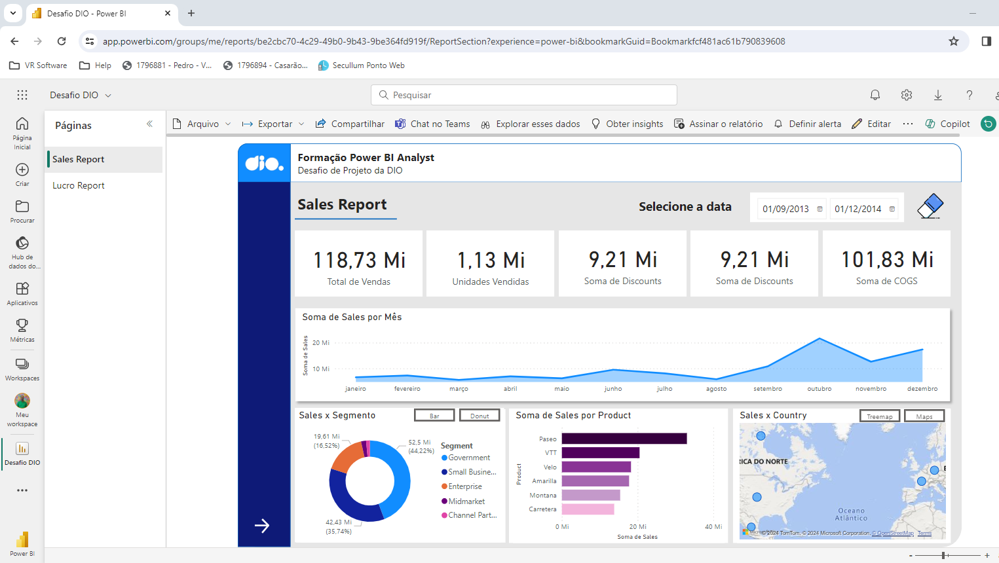
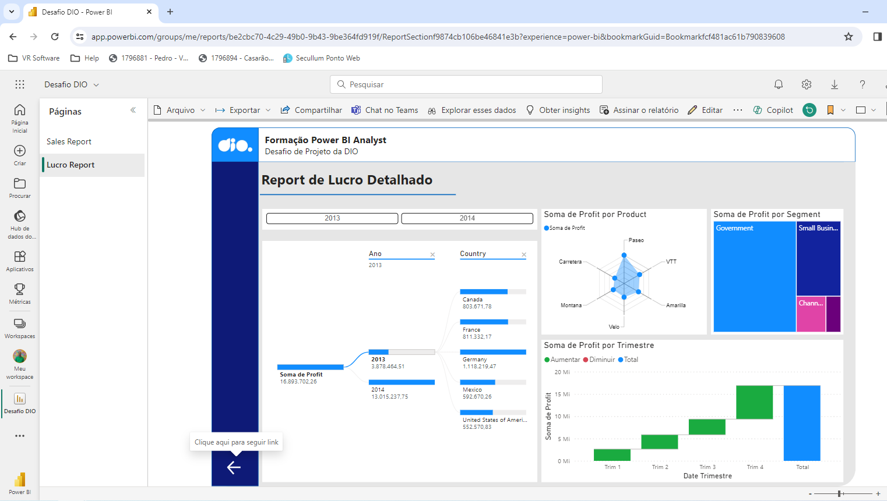
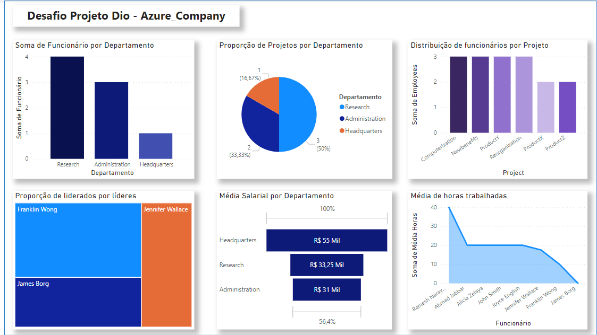

# power_bi_analyst

Repositório relacionado a formação de Power BI Analyst


### Desafio DIO

[Arquivo do projeto do desafio](./desafio_dio/Desafio_DIO.pbix)







### Desafio Dio_2 - Azure_company

#### Etapa de inserção de dados da base Mysql
- Encontrado problema para inserir os dados em employee;

    - Foi necessário ajustar o insert para que a ordem de inserção tivesse o gerente antes do colaborador que depende do gerente, sql após alteração:
    ```
    insert into employee values 
    ('James', 'E', 'Borg', 888665555, '1937-11-10', '450-Stone-Houston-TX', 'M', 55000, NULL, 1),
    ('Jennifer', 'S', 'Wallace', 987654321, '1941-06-20', '291-Berry-Bellaire-TX', 'F', 43000, 888665555, 4),
    ('Franklin', 'T', 'Wong', 333445555, '1955-12-08', '638-Voss-Houston-TX', 'M', 40000, 888665555, 5),
    ('Alicia', 'J', 'Zelaya', 999887777, '1968-01-19', '3321-Castle-Spring-TX', 'F', 25000, 987654321, 4),
    ('Ahmad', 'V', 'Jabbar', 987987987, '1969-03-29', '980-Dallas-Houston-TX', 'M', 25000, 987654321, 4),
    ('John', 'B', 'Smith', 123456789, '1965-01-09', '731-Fondren-Houston-TX', 'M', 30000, 333445555, 5),
    ('Ramesh', 'K', 'Narayan', 666884444, '1962-09-15', '975-Fire-Oak-Humble-TX', 'M', 38000, 333445555, 5),
    ('Joyce', 'A', 'English', 453453453, '1972-07-31', '5631-Rice-Houston-TX', 'F', 25000, 333445555, 5);
    ```


#### Etapa de tansformação dos dados com Power Query

##### Extração
- Trouxe toda a base, visto que eram poucas informações;

##### Limpeza
- Removida as informações de metadados, deixando os dados mais limpos possível;

- Realizada mesclagens de tabelas para formar novas tabelas com agrupamentos, para criação dos visuais;

Obs.: A mesclagem foi utilizada por precisar unir dados em novas tabelas, como explicado no ponto 2. Após a mesclaem, realizei novas limpezas e fiz os agrupamentos necessários para visuais.

##### Carregamento dos dados
- Foi feito aos poucos, conforme criava as ideias das métricas do relatório;

- Então eu voltava e mesclava novas ideias;

[Arquivo do projeto do desafio - azure company](./desafio_dio/azure_company/Desafio_Dio_Azure_Company.pbixDesafio_DIO.pbix)


